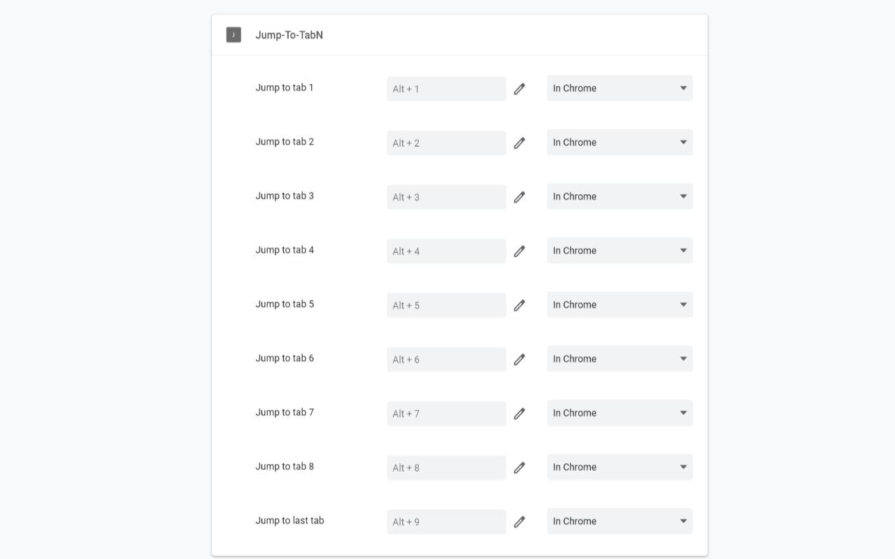

# Jump To Tab

Jump to specific tab with shortcut keys

## Motivation

Because chrome use `Ctrl + 1` through `Ctrl + 8`, but I prefer use `Alt + <num>` to jump to specific tab

## How to use

1. Install extensions in [chrome web store]()
2. Go to [chrome://extensions/shortcuts](chrome://extensions/shortcuts) 
3. Setup shortcuts for commands

