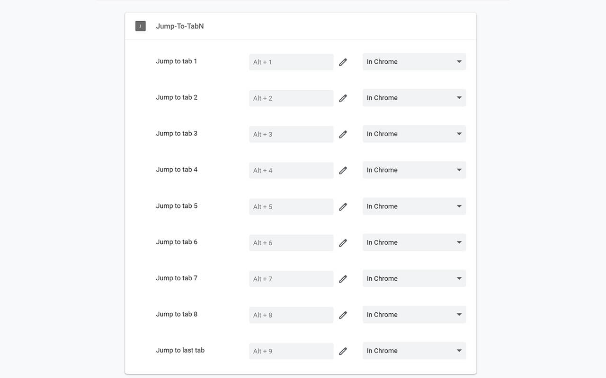

# Jump To TabN

Jump to specific tab with shortcut keys

## Motivation

Because chrome use `Ctrl + 1` through `Ctrl + 9`, but I prefer use `Alt + <num>` to jump to specific tab

## How to use

1. Install extensions in [chrome web store](https://chrome.google.com/webstore/detail/jump-to-tabn/jgpipjhejajkakblimanokjdcooabapp?hl=en&authuser=0)
2. Go to `chrome://extensions/shortcuts`
3. Setup shortcuts for commands

